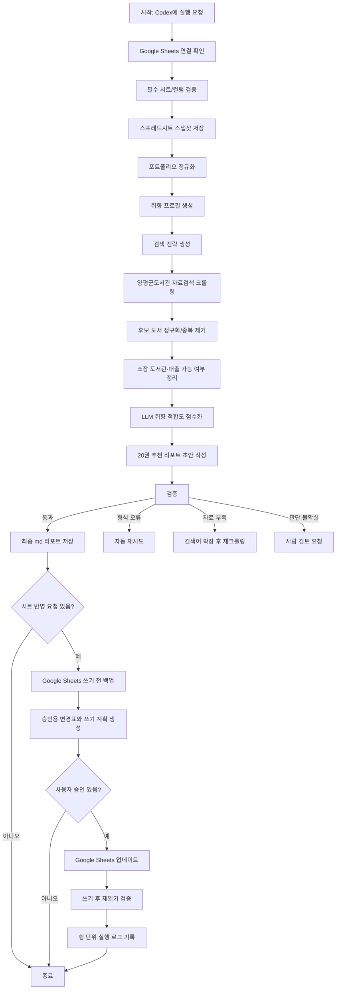

# 양평군도서관 × Google Sheets 독서 포트폴리오 기반 추천 에이전트 통합 설계서

- 문서 목적: VS Code에서 Codex(GPT-5.5)에 구현을 맡길 때 참조할 계획서
- 실행 방식: 로컬 Python 실행형
- LLM API 사용 여부: 사용하지 않음
- 외부 저장소 API 사용 여부: Google Sheets API 사용
- 원본 데이터 저장소: Google Spreadsheet 1개
- LLM 판단 방식: VS Code 안의 Codex가 로컬 산출물 파일과 Google Sheets 스냅샷을 읽고 판단·점수화·리포트 작성
- 대상 도서관 범위: 양평군 관내 도서관 전체
- v1 핵심 목표: Codex 대화형 실행으로 양평군도서관에서 바로 빌릴 수 있는 책을 신뢰도 있게 추천하는 dry-run 완성
- 최종 산출물: 취향에 맞는 후보 20권 추천 리포트(md) + 검증 요약 + 승인 기반 Google Sheets 업데이트 계획

---

## 0. v1 인터뷰 결정 요약

v1은 “완전 자동 추천 서비스”가 아니라 **Codex와 대화하면서 지금 실제로 빌릴 수 있는 책을 좁혀주는 로컬 독서 비서**다. 추천의 1차 가치는 `즉시 대출 추천`이며, 취향 탐색은 고평점 도서와 최근 관심사를 중심으로 안전하게 확장한다.

| 결정 영역 | v1 결정 |
|---|---|
| 핵심 가치 | 바로 빌릴 수 있는 책을 신뢰도 있게 추천 |
| 사용 화면 | VS Code/Codex 대화형 실행 |
| 자동화 경계 | Google Sheets 쓰기는 항상 사용자 승인 후 실행 |
| 후보 탐색 | 취향 근접 후보를 중심으로 일부 낯선 후보를 섞는 안전한 확장 |
| 대출 상태 | `바로 빌릴 책`, `예약/추적`, `확인 필요`로 분리 표시 |
| 실패 노출 | 최종 보고서에는 영향도와 원인 요약, 상세 로그는 파일로 보관 |
| 시트 컬럼 | 유사명 자동 매핑, 애매하면 사람 확인 |
| 중복 판정 | 정규화된 제목+저자 우선, ISBN은 보조 신호 |
| 리포트 문체 | 줄거리보다 취향 근거와 검증 가능한 자료 중심 |
| 피드백 | `끌림`, `별로`, `보류` + 선택 메모 |
| 보안 운영 | `secrets/`, `output/`, `backups/` git 제외와 최근 N회 보존 |
| Sheets 동기화 | 명령 실행 시 최신 시트를 읽고, 승인 후 즉시 쓰기. 백그라운드 실시간 감시는 v1 제외 |
| 신착 정보 | 점수 가산점은 기본 적용하지 않지만 입고일/등록일은 추천 결과에 표시 |
| v1 완료 기준 | 실제 시트 읽기, 후보 수집, md 리포트 생성, 검증 통과. 실제 쓰기는 승인 계획까지만 포함 |

v1에서 추천은 억지로 성공 처리하지 않는다. 후보가 부족하거나 대출 상태가 불명확하면 20권을 강제로 채우기보다 조건부 실패로 보고하고, 다음 실행에서 보강할 검색어·설정·수동 후보 입력을 제안한다.

---

## 1. 작업 컨텍스트 문서

### 1.1 배경

사용자는 양평도서관에서 책 읽는 것을 좋아하고, 독서 취향을 Google Spreadsheet로 관리한다. 기존 독서 포트폴리오는 `읽은 책`, `읽는 중`, `읽을 예정`의 3개 시트 구조를 기본으로 한다.

이 에이전트는 엑셀 파일을 별도로 만들지 않고, **Google Spreadsheet 하나를 독서 포트폴리오의 원본 DB**로 사용한다. 로컬 Python 스크립트는 Google Sheets API를 통해 해당 스프레드시트를 읽고, 필요한 경우 같은 스프레드시트에 다시 기록한다.

핵심 방향은 다음과 같다.

> 사용자는 Google Spreadsheet만 계속 관리한다.  
> 에이전트는 그 시트를 읽고, 양평군도서관에서 후보 책을 찾고, 취향에 맞는 책을 추천하고, 사용자가 요청하고 승인하면 다시 Google Spreadsheet에 반영한다.

### 1.2 목적

양평군도서관 자료검색 결과를 수집하고, 사용자의 Google Sheets 독서 포트폴리오와 비교하여 취향 적합도가 높고 실제 대출 행동으로 이어질 수 있는 후보 도서 20권을 추천한다.

이 에이전트가 답해야 할 핵심 질문은 다음이다.

> “양평군 관내 도서관에서 실제로 찾을 수 있고, 내 독서 취향에 맞는 책은 무엇인가?”

부가 목적은 다음과 같다.

- 추천 결과 중 읽고 싶은 책을 `읽을 예정` 시트에 반영한다.
- 완독한 책을 `읽은 책` 시트에 기록한다.
- 평점, 감상, 태그, 추천 피드백을 다음 추천에 반영한다.
- 추천 제외 조건이나 선호 조건을 Google Sheets 안에서 관리할 수 있게 한다.
- Google Sheets 쓰기 전에는 사람이 읽는 변경표를 먼저 제시하고, 승인 후에만 실제 쓰기 작업을 수행한다.
- 사용자가 Google Sheets에 직접 내용을 수정한 뒤 에이전트에게 다시 실행 또는 새로고침을 요청하면, 에이전트는 최신 시트 상태를 다시 읽고 분석한다.
- 추천 결과에는 가능한 경우 도서관 입고일, 등록일, 신착 여부를 표시하여 새책 선호를 판단할 수 있게 한다.

### 1.3 범위

#### 포함 범위

- Google Spreadsheet에서 독서 포트폴리오 읽기
- `읽은 책`, `읽는 중`, `읽을 예정` 시트 파싱
- 선택 시트인 `추천 설정`, `추천 피드백`, `추천 결과`, `실행 로그` 반영
- 취향 신호 추출
- 양평군도서관 관내 전체 자료검색 크롤링
- 소장 도서관 및 대출 가능 여부 수집
- 이미 읽은 책, 읽는 중, 읽을 예정 책과 후보 도서 비교
- Codex 기반 취향 적합도 점수화
- 후보 20권 추천 리포트 생성
- 사용자가 요청하고 승인한 경우에만 Google Sheets에 결과 반영
- 로컬 스냅샷, 백업, 로그 저장
- 검증 및 실패 처리

#### 제외 범위

- OpenAI API, Gemini API, Claude API 등 외부 LLM API 호출
- 도서관 로그인 기반 마이페이지 크롤링
- 자동 예약, 자동 대출 연장, 자동 희망도서 신청
- 저작권 있는 책 본문 수집
- v1에서 전자책·오디오북을 추천 후보로 포함
- 대량·고속 크롤링
- Google 계정 비밀번호 저장
- Google Sheets 외 별도 엑셀 원본 관리

### 1.4 원본 데이터 원칙

이 프로젝트의 원본 데이터는 Google Spreadsheet 하나다.

```text
Google Spreadsheet
  ├── 읽은 책
  ├── 읽는 중
  ├── 읽을 예정
  ├── 추천 설정        # 선택
  ├── 추천 피드백      # 선택
  ├── 추천 결과        # 선택
  └── 실행 로그        # 선택
```

로컬 파일은 원본이 아니라 실행 중간 산출물이다.

| 구분 | 저장 위치 | 역할 |
|---|---|---|
| 원본 포트폴리오 | Google Spreadsheet | 사용자의 실제 독서 DB |
| 추천 설정 | Google Spreadsheet의 `추천 설정` 시트 | 제외 작가, 우선 도서관, 점수 가중치 등 |
| 추천 결과 | 로컬 md + 선택적으로 `추천 결과` 시트 | 사람이 읽는 추천 리포트 |
| 실행 로그 | 로컬 로그 + 선택적으로 `실행 로그` 시트 | 언제 무엇을 읽고 썼는지 기록 |
| 백업 | `/backups`, `/output/<run_id>/snapshot` | 쓰기 전 안전장치 |

### 1.5 Google Spreadsheet 시트 구조

#### 1.5.1 필수 시트

| 시트 | 역할 | 최소 컬럼 |
|---|---|---|
| 읽은 책 | 취향 학습의 핵심 데이터 | 작가, 제목, 별점, 비고 |
| 읽는 중 | 현재 관심사와 열린 포지션 | 작가, 제목, 현재 평점 |
| 읽을 예정 | 후보·관심 도서 목록 | 작가, 제목, 추천여부 |

#### 1.5.2 권장 확장 시트

| 시트 | 역할 | 예시 컬럼 |
|---|---|---|
| 추천 설정 | 제외·우선순위·가중치 관리 | key, value, memo |
| 추천 피드백 | 추천 결과에 대한 사용자 반응 저장 | 실행일, 제목, 저자, 반응, 메모 |
| 추천 결과 | 최근 추천 20권을 시트에도 저장 | 순위, 제목, 저자, 점수, 상태, 링크 |
| 실행 로그 | 읽기/쓰기 작업 이력 | 실행일시, 작업, 대상, 결과 |

초기 MVP에서는 필수 3개 시트만 있어도 동작한다. 확장 시트가 없으면 에이전트가 생성할 수 있게 한다.

### 1.6 입력 정의

| 입력 | 형식 | 필수 여부 | 설명 |
|---|---|---:|---|
| Google Spreadsheet ID 또는 URL | 문자열 | 필수 | 독서 포트폴리오 원본 |
| Google 서비스 계정 키 | `.json` | 필수 | 로컬 Python이 Google Sheets를 읽고 쓰기 위한 인증 파일 |
| 양평군도서관 검색 설정 | `config/yplib.yaml` | 선택 | 검색 URL, 셀렉터, 요청 간격, 도서관 범위 |
| 실행 모드 | CLI 인자 | 선택 | 추천만 할지, 시트에도 쓸지 결정 |
| 수동 후보 목록 | `.csv` 또는 `.json` | 선택 | 사용자가 추가로 확인하고 싶은 책 목록 |

### 1.7 출력 정의

최종 추천 리포트는 `/output/<run_id>/recommendation_report.md`에 저장한다.

추천 도서 1권마다 다음 필드를 가진다.

```md
## 바로 빌릴 책

### 1. 제목
- 제목:
- 저자:
- 소장 도서관:
- 대출 가능 여부:
- 입고일/등록일:
- 신착 여부:
- 추천 점수:
- 세부 점수: 취향 일치 / 입질 가능성 / 신선도 / 접근성 / 포트폴리오 반영
- 내 취향과 맞는 이유:
- 근거와 확신도:
- 30페이지 테스트 포인트:
```

20권 전체는 대출 가능성에 따라 아래처럼 나누어 출력한다.

1. 바로 빌릴 책
2. 예약하거나 추적할 책
3. 대출 가능 여부가 불확실하지만 취향상 확인할 책

선택적으로 같은 결과를 Google Spreadsheet의 `추천 결과` 시트에도 반영한다.

단, `추천 결과` 시트 저장은 기본 동작이 아니다. 사용자가 별도로 요청하면 먼저 `approval_preview.md` 형태의 변경표와 `sheets_update_plan.json`을 생성하고, 승인된 경우에만 실제 Google Sheets 쓰기를 수행한다.

### 1.8 주요 제약조건

| 제약 | 설계 반영 방식 |
|---|---|
| OpenAI API 없이 사용 | LLM API 호출 금지. VS Code Codex가 로컬 파일을 읽고 판단 |
| Google Sheets를 원본으로 사용 | 엑셀 파일을 원본으로 두지 않음. 시트에서 읽고 시트에 씀 |
| Google Sheets 자동 수정 필요 | 서비스 계정 기반 쓰기 스크립트를 제공하되, 실제 쓰기는 승인 후에만 수행 |
| 로컬 실행 | Python 스크립트와 파일 기반 산출물 사용 |
| 도서관 사이트 구조 변경 가능 | 셀렉터를 코드에 고정하지 않고 설정 파일로 분리 |
| 동적 페이지 가능성 | v1 기본은 `requests + BeautifulSoup`, `Playwright`는 후속 fallback 후보로만 문서화 |
| 과도한 크롤링 금지 | 느리지만 안전한 요청 간격, 캐시, 재시도 제한, HTML 스냅샷 저장 |
| 취향은 고정값이 아님 | 매번 Google Sheets에서 취향 프로필 재생성 |
| Google Sheets 실시간성 | 명령 실행 시마다 최신 시트를 다시 읽고, 백그라운드 상시 감시는 v1 범위에서 제외 |
| 제외 조건은 기본 적용하지 않음 | 사용자가 `추천 설정` 시트에서 지정한 경우만 적용 |
| 시트 손상 위험 | 쓰기 전 스냅샷 백업, 쓰기 후 재검증, 변경 로그 저장 |
| 후보 부족 가능성 | 20권을 억지로 채우지 않고 조건부 실패와 보강 제안을 출력 |
| 새책 선호 | 입고일/등록일은 표시하되 v1 기본 점수 가산점은 적용하지 않음 |

### 1.9 용어 정의

| 용어 | 정의 |
|---|---|
| 독서 포트폴리오 | Google Spreadsheet에 저장된 사용자의 읽은 책, 읽는 중, 읽을 예정 데이터 |
| 원본 DB | 이 프로젝트에서 신뢰하는 단일 원본. Google Spreadsheet를 의미 |
| 취향 DNA | 고평점·비고·읽을 예정·피드백 데이터를 종합해 추출한 선호 패턴 |
| 후보 도서 | 도서관 검색 결과에서 추천 대상으로 남은 책 |
| 취향 적합도 | 사용자의 포트폴리오 기준으로 Codex가 판단한 추천 점수 |
| 30페이지 테스트 | 첫 30페이지 안에 입질이 오는지 확인하는 독서 선별 기준. v1은 실물 도서 기준 |
| 바로 빌릴 책 | 대출 가능 상태이고, 취향 점수도 높은 책 |
| 예약 후보 | 현재 대출 중이거나 상태가 불확실하지만 취향 점수가 높은 책 |
| 쓰기 작업 | Google Sheets에 행 추가, 행 수정, 상태 이동, 로그 기록 등을 수행하는 작업 |
| 입고일/등록일 | 도서관 검색 결과에서 확인되는 자료 등록일, 입수일, 입고일, 신착일 계열의 날짜 |
| 신착 여부 | 입고일/등록일이 최근 기준 안에 있거나 도서관이 신착 자료로 표시한 상태. v1에서는 정보 표시용이며 기본 가산점은 없음 |

---

## 2. 워크플로우 정의

### 2.1 전체 흐름도



### 2.2 상태 전이

| 상태 | 설명 | 다음 상태 |
|---|---|---|
| `INIT` | 실행 시작 | `SHEETS_CONNECTED` |
| `SHEETS_CONNECTED` | Google Sheets 접근 성공 | `SHEETS_SCHEMA_VALIDATED` |
| `SHEETS_SCHEMA_VALIDATED` | 필수 시트와 컬럼 확인 | `PORTFOLIO_SNAPSHOT_READY` |
| `PORTFOLIO_SNAPSHOT_READY` | 쓰기 전 스냅샷 저장 | `PORTFOLIO_READY` |
| `PORTFOLIO_READY` | 시트 데이터 정규화 완료 | `TASTE_PROFILE_READY` |
| `TASTE_PROFILE_READY` | 취향 요약 파일 생성 | `QUERY_PLAN_READY` |
| `QUERY_PLAN_READY` | 검색어와 검색 우선순위 생성 | `RAW_CRAWL_READY` |
| `RAW_CRAWL_READY` | 도서관 검색 결과 원본 저장 | `CANDIDATE_POOL_READY` |
| `CANDIDATE_POOL_READY` | 후보 도서 정규화 완료 | `SCORED_READY` |
| `SCORED_READY` | 취향 점수 부여 완료 | `REPORT_DRAFTED` |
| `REPORT_DRAFTED` | 추천 리포트 초안 생성 | `VALIDATED` 또는 `RETRY_REQUIRED` |
| `VALIDATED` | 최종 산출물 저장 | `WRITE_PENDING` 또는 종료 |
| `WRITE_PENDING` | Google Sheets 반영 대기 | `SHEETS_UPDATED` |
| `SHEETS_UPDATED` | Google Sheets 쓰기 완료 | `WRITE_VALIDATED` |
| `WRITE_VALIDATED` | 쓰기 후 재읽기 검증 완료 | 종료 |
| `ESCALATED` | 사람 확인 필요 | 사용자 확인 후 재개 |

### 2.3 단계별 처리 방식

| 단계 | 처리 주체 | 산출물 | 설명 |
|---|---|---|---|
| 1. Google Sheets 연결 확인 | 스크립트 | `sheets_connection_check.json` | 인증, 접근 권한, 스프레드시트 ID 확인 |
| 2. 시트 스키마 검증 | 스크립트 | `sheets_schema_check.json` | 필수 시트와 컬럼 확인 |
| 3. 스냅샷 저장 | 스크립트 | `portfolio_snapshot.json` | 원본 시트를 로컬 JSON으로 백업 |
| 4. 포트폴리오 정규화 | 스크립트 | `portfolio_normalized.json` | 책 목록을 표준 구조로 변환 |
| 5. 취향 프로필 생성 | 코드 + LLM | `taste_profile.md`, `taste_profile.json` | 통계는 코드, 의미 해석은 Codex |
| 6. 검색 전략 생성 | LLM + 코드 | `query_plan.json` | 고평점 작가/키워드/장르 기반 검색어 생성 |
| 7. 도서관 크롤링 | 스크립트 | `raw_search_results.json`, `html_snapshots/` | 자료검색 결과 수집 |
| 8. 후보 정규화 | 스크립트 | `candidates_normalized.json` | 제목, 저자, ISBN, 소장관, 상태 정리 |
| 9. 후보 필터링 | 스크립트 | `candidate_pool.json` | 중복 제거, 설정 기반 제외 규칙 적용 |
| 10. 취향 점수화 | LLM | `scored_candidates.json` | Codex가 취향 적합도와 이유 작성 |
| 11. 리포트 생성 | LLM + 템플릿 | `recommendation_report.md` | 20권 추천 리포트 작성 |
| 12. 검증 | 스크립트 + LLM | `validation_report.json` | 필수 필드, 권수, 중복, 근거 품질 확인 |
| 13. Google Sheets 쓰기 계획 | LLM + 스크립트 | `approval_preview.md`, `sheets_update_plan.json` | 사용자가 요청한 변경을 사람이 읽는 변경표와 실행용 JSON으로 분리 |
| 14. Google Sheets 반영 | 스크립트 | `sheets_update_result.json` | 사용자가 승인한 변경만 시트에 기록 |
| 15. 쓰기 후 검증 | 스크립트 | `sheets_write_validation.json` | 다시 읽어서 변경 반영 확인 |

### 2.4 LLM 판단 영역과 코드 처리 영역 구분

| LLM이 직접 수행 | 스크립트로 처리 |
|---|---|
| 취향 DNA 요약 | Google Sheets 읽기/쓰기 |
| 고평점 책에서 선호 패턴 추론 | 서비스 계정 인증 |
| 낮은 평점·손절 기록에서 회피 패턴 추론 | 시트 스키마 검증 |
| 검색어 우선순위 판단 | 도서관 검색 결과 크롤링 |
| 후보 도서의 취향 적합도 평가 | HTML 파싱 |
| 추천 사유 작성 | 중복 제거, ISBN 정규화 |
| 30페이지 테스트 포인트 작성 | 대출 상태 필드 추출 |
| 사용자가 요청한 포트폴리오 변경 의도 해석 | Google Sheets 행 추가/수정/이동 |
| 변경 요약 문장 작성 | JSON/CSV/md 파일 저장 |

### 2.5 LLM이 직접 수행할 판단/의사결정 단계

#### A. 취향 프로필 해석

Codex는 `portfolio_normalized.json`과 `추천 피드백` 시트 요약을 읽고 다음을 판단한다.

- 사용자가 강하게 선호하는 서사 구조
- 고평점이 반복되는 작가·장르·정서
- 낮은 평점 또는 손절 도서에서 드러나는 회피 패턴
- 비문학에서 선호하는 효용 유형
- 지금 읽는 중/읽을 예정 도서가 시사하는 최근 관심사
- 최근 추천 피드백에서 강화되거나 약해진 취향 신호

#### B. 검색 전략 생성

Codex는 다음 기준으로 검색어 묶음을 만든다.

1. 고평점 작가 기반 검색어
2. 고평점 도서와 유사한 장르·키워드 검색어
3. 비문학 관심사 기반 검색어
4. 읽을 예정 도서의 보유 여부 확인 검색어
5. 블랙스완 후보 탐색용 넓은 검색어
6. 최근 피드백 기반 보정 검색어

#### C. 취향 적합도 점수화

Codex는 후보 도서를 다음 기준으로 100점 만점 평가한다.

| 항목 | 배점 | 판단 기준 |
|---|---:|---|
| 취향 DNA 일치도 | 40 | 기존 고평점 도서와 구조·정서·효용이 비슷한가 |
| 즉시 입질 가능성 | 20 | 첫 30페이지 안에 몰입 가능성이 높은가 |
| 신선도 | 15 | 기존 취향을 반복하되 너무 뻔하지 않은가 |
| 도서관 접근성 | 15 | 대출 가능하고 선호 도서관에서 접근 가능한가 |
| 포트폴리오 상태 반영 | 10 | 이미 읽은 책은 제외하고, 읽을 예정 책은 적절히 표시했는가 |

리포트에는 총점만 쓰지 않고 위 5개 하위 점수를 함께 표시한다. 점수 근거는 검증 가능한 입력 자료를 우선하며, 후보 도서의 내용·분위기를 Codex가 추정한 경우 `추정` 또는 `확신도 낮음`으로 표시한다.

#### D. Google Sheets 업데이트 의도 해석

사용자가 자연어로 다음처럼 요청하면 Codex가 변경 의도를 구조화한다.

```text
『명탐정의 제물』 다 읽었어. 4.0점. 반전은 좋았는데 구조가 헷갈렸다고 기록해줘.
```

Codex는 이를 다음 작업으로 해석한다.

```json
{
  "action": "mark_as_read",
  "title": "명탐정의 제물",
  "author": "시라이 도모유키",
  "target_sheet": "읽은 책",
  "rating": 4.0,
  "note": "반전은 좋았지만 구조가 헷갈렸음",
  "source_sheet_candidates": ["읽는 중", "읽을 예정"]
}
```

실제 행 추가/수정/이동은 스크립트가 처리한다.

### 2.6 Google Sheets 쓰기 작업 유형

아래 작업은 모두 동일한 승인 흐름을 따른다. 먼저 `approval_preview.md`와 `sheets_update_plan.json`을 생성하고, 사용자가 승인한 뒤 `--approved --commit`이 함께 있을 때만 실제 시트를 수정한다.

| 작업 | 사용자 요청 예시 | 처리 방식 |
|---|---|---|
| 읽을 예정 추가 | “이 책 읽을 예정에 넣어줘” | `읽을 예정` 시트에 중복 확인 후 추가 |
| 읽는 중 추가 | “이제 이 책 읽기 시작했어” | `읽는 중` 시트에 추가하고 기존 위치 표시 |
| 완독 처리 | “다 읽었어. 4.5점이야” | `읽는 중` 또는 `읽을 예정`에서 찾아 `읽은 책`으로 이동/기록 |
| 평점 수정 | “이 책 4.0에서 4.5로 바꿔줘” | 제목·저자 기준으로 기존 행 업데이트 |
| 비고 추가 | “먹먹했지만 좋았다고 메모해줘” | 해당 행의 비고/메모 컬럼 업데이트 |
| 추천 피드백 기록 | “3번은 별로, 7번은 끌려” | `추천 피드백` 시트에 반응 기록 |
| 제외 조건 추가 | “앞으로 이 작가는 제외해줘” | `추천 설정` 시트에 제외 규칙 추가 |
| 추천 결과 저장 | “이번 추천 결과도 시트에 남겨줘” | `추천 결과` 시트에 20권 저장 |

### 2.7 단계별 성공 기준, 검증 방법, 실패 처리

| 단계 | 성공 기준 | 검증 방법 | 실패 시 처리 |
|---|---|---|---|
| Google Sheets 연결 | 서비스 계정으로 대상 시트 접근 가능 | API 응답 검증 | 권한/ID/키 파일 경로 에스컬레이션 |
| 시트 스키마 검증 | 필수 3개 시트와 최소 컬럼 존재 | 스키마 검증 | 누락 시 생성 가능 여부 확인 또는 중단 |
| 스냅샷 저장 | 전체 시트 데이터가 JSON으로 저장됨 | 파일 존재·행 수 검증 | 저장 실패 시 쓰기 작업 금지 |
| 포트폴리오 정규화 | 모든 행이 표준 구조로 변환됨 | 스키마 검증 | 누락 컬럼은 로그 후 가능한 범위만 파싱 |
| 취향 프로필 생성 | 선호/비선호/최근 관심사가 md와 json으로 생성됨 | LLM 자기 검증 | 근거 부족 시 고평점 데이터 중심으로 재작성 |
| 검색 전략 생성 | 최소 30개 이상 검색어 또는 검색 단서 생성 | 규칙 기반 | 검색어가 적으면 고평점 작가·제목 기반 확장 |
| 크롤링 | 원본 검색 결과가 저장되고 요청 실패율이 허용 범위 이내 | 규칙 기반 | 최대 2회 재시도, 실패 URL 로그 |
| 후보 정규화 | 제목·저자·소장 도서관·상태 필드 정리 | 스키마 검증 | 파싱 실패 항목은 `status_unknown`으로 보존 |
| 후보 필터링 | 최소 40권 이상 후보 확보 | 규칙 기반 | 무리하게 20권을 채우지 않고 조건부 실패와 보강 제안 출력 |
| 취향 점수화 | 후보마다 점수와 추천 이유 존재 | LLM 자기 검증 + 스키마 검증 | 점수 누락 항목만 재평가 |
| 리포트 생성 | 원칙적으로 20권 출력, 부족 시 조건부 실패 표시 | 규칙 기반 | 자동 재작성 1회 또는 부족 사유 보고 |
| Google Sheets 쓰기 계획 | 승인용 변경표와 실행용 JSON이 생성됨 | 스키마 검증 + 사람이 읽는 diff 검토 | 불확실하면 실제 쓰기 금지 |
| Google Sheets 쓰기 | 승인된 변경이 대상 시트에 반영됨 | 쓰기 후 재읽기 검증 | 실패 시 롤백 안내, 스냅샷 보존 |
| 최종 검증 | 중복 없음, 읽은 책 제외, 링크/소장정보 존재 | 스키마 + 규칙 + LLM 검토 | 치명 오류는 에스컬레이션 |

### 2.8 실패 처리 패턴

| 실패 유형 | 예시 | 처리 |
|---|---|---|
| 단순 형식 오류 | 필수 필드 누락, JSON 파싱 실패 | 자동 재시도 최대 2회 |
| Google 인증 실패 | 서비스 계정 키 오류, 권한 없음 | 사람에게 설정 수정 요청 |
| 시트 구조 불일치 | 컬럼명이 다름 | 유사 컬럼 자동 매핑, 불확실하면 에스컬레이션 |
| 쓰기 전 백업 실패 | 스냅샷 저장 실패 | Google Sheets 쓰기 금지 |
| 중복 도서 발견 | 같은 제목·저자가 여러 시트에 있음 | 기존 행 업데이트 우선, 애매하면 에스컬레이션 |
| 자료 부족 | 후보가 40권 미만이거나 최종 20권 품질이 낮음 | 조건부 실패로 보고하고 검색어·설정·수동 후보 보강 제안 |
| 사이트 구조 변경 | CSS 선택자 실패 | HTML 스냅샷 저장 후 셀렉터 수정 요청 |
| 대출 상태 불명 | 상태 텍스트 미검출 | `대출 가능 여부: 확인 필요`로 표시 |
| 판단 불확실 | 취향 근거가 약한 후보 | 점수 낮게 부여하거나 사람 검토 표시 |
| 로그인 필요 | 예약/마이페이지 접근 | 자동 처리하지 않고 안내문 출력 |

---

## 3. 구현 스펙

> 이 장은 구조와 역할 정의 수준까지만 작성한다. `CODEX.md`, `SKILL.md`, `AGENT.md`의 상세 문구는 구현 단계에서 작성한다.

### 3.1 권장 폴더 구조

```text
/project-root
  ├── CODEX.md
  ├── README.md
  ├── requirements.txt
  ├── .gitignore
  ├── config
  │   ├── app.yaml                  # spreadsheet_id, 실행 기본값, 로컬 경로
  │   └── yplib.yaml                # 양평군도서관 크롤링 설정
  ├── secrets
  │   └── google_service_account.json   # 깃허브 업로드 금지
  ├── data
  │   └── cache
  ├── backups
  │   └── <run_id>
  │       └── portfolio_snapshot_before_write.json
  ├── output
  │   └── <run_id>
  │       ├── sheets_connection_check.json
  │       ├── sheets_schema_check.json
  │       ├── portfolio_snapshot.json
  │       ├── portfolio_normalized.json
  │       ├── portfolio_stats.json
  │       ├── taste_profile.md
  │       ├── taste_profile.json
  │       ├── query_plan.json
  │       ├── raw_search_results.json
  │       ├── candidates_normalized.json
  │       ├── candidate_pool.json
  │       ├── scored_candidates.json
  │       ├── recommendation_report.md
  │       ├── validation_summary.md
  │       ├── approval_preview.md
  │       ├── sheets_update_plan.json
  │       ├── sheets_update_result.json
  │       ├── sheets_write_validation.json
  │       ├── validation_report.json
  │       └── logs
  │           └── run.log
  ├── src
  │   ├── __init__.py
  │   ├── main.py
  │   ├── sheets
  │   │   ├── sheets_client.py
  │   │   ├── read_portfolio.py
  │   │   ├── update_portfolio.py
  │   │   ├── validate_sheets_schema.py
  │   │   └── snapshot_sheets.py
  │   ├── portfolio
  │   │   ├── normalize_portfolio.py
  │   │   └── taste_stats.py
  │   ├── library
  │   │   ├── crawl_yplib.py
  │   │   ├── parse_yplib.py
  │   │   └── normalize_books.py
  │   ├── recommendation
  │   │   ├── build_query_plan.py
  │   │   ├── candidate_filter.py
  │   │   └── report_template.py
  │   └── validation
  │       ├── validate_outputs.py
  │       └── validate_sheet_write.py
  ├── .codex
  │   ├── skills
  │   │   ├── sheets-portfolio-reader
  │   │   │   ├── SKILL.md
  │   │   │   └── scripts
  │   │   │       └── read_portfolio.py
  │   │   ├── sheets-portfolio-updater
  │   │   │   ├── SKILL.md
  │   │   │   └── scripts
  │   │   │       └── update_portfolio.py
  │   │   ├── yplib-crawler
  │   │   │   ├── SKILL.md
  │   │   │   ├── scripts
  │   │   │   │   └── crawl_yplib.py
  │   │   │   └── references
  │   │   │       └── selectors.yaml
  │   │   ├── candidate-normalizer
  │   │   │   ├── SKILL.md
  │   │   │   └── scripts
  │   │   │       └── normalize_books.py
  │   │   ├── preference-scorer
  │   │   │   └── SKILL.md
  │   │   └── report-validator
  │   │       ├── SKILL.md
  │   │       └── scripts
  │   │           └── validate_outputs.py
  │   └── agents
  │       └── README.md
  └── docs
      ├── google_sheets_setup.md
      ├── yplib_site_notes.md
      └── troubleshooting.md
```

`.gitignore`의 최소 기준은 다음과 같다.

```gitignore
secrets/
output/
backups/
data/cache/
*.log
```

### 3.2 CODEX.md 핵심 섹션 목록

`CODEX.md`에는 다음 섹션만 두고, 상세 지침은 구현 단계에서 작성한다.

1. 미션
2. 실행 모드: 로컬 Python + VS Code Codex
3. 원본 데이터 원칙: Google Spreadsheet가 단일 원본 DB
4. 금지 사항: 외부 LLM API 호출 금지, 로그인 크롤링 금지, 과도한 요청 금지
5. Google Sheets 읽기/쓰기 계약
6. 출력 파일 계약
7. 워크플로우 순서
8. LLM 판단 기준
9. 취향 점수화 루브릭
10. 30페이지 테스트 작성 규칙
11. Google Sheets 업데이트 의도 해석 규칙
12. 쓰기 승인 변경표 작성 규칙
13. 예외·제외 설정 반영 규칙
14. 실패 처리 규칙
15. 검증 게이트
16. 최종 보고서 형식

### 3.3 에이전트 구조

#### 선택: 단일 에이전트 구조

초기 버전은 단일 에이전트가 적합하다.

이유는 다음과 같다.

- 작업 흐름이 한 방향이다.
- Google Sheets 읽기/쓰기, 크롤링, 검증은 스크립트로 분리할 수 있다.
- LLM 판단 영역은 취향 해석, 추천 사유 작성, 자연어 업데이트 의도 해석으로 제한된다.
- 외부 LLM API 없이 VS Code Codex가 오케스트레이터 역할을 수행한다.

#### 서브에이전트는 초기 버전에서 사용하지 않음

`/.codex/agents`는 비워두거나 README만 둔다. 향후 다음 조건이면 서브에이전트를 분리한다.

| 서브에이전트 후보 | 분리 시점 |
|---|---|
| `sheets-maintainer` | Google Sheets 구조와 업데이트 규칙이 복잡해질 때 |
| `crawler-maintainer` | 양평군도서관 사이트 구조 변경이 자주 발생할 때 |
| `taste-analyst` | 포트폴리오가 매우 커지고 취향 분석 규칙이 길어질 때 |
| `report-editor` | 보고서 문체와 형식이 복잡해질 때 |

### 3.4 작업 단계별 처리 방식

| 작업 단계 | 에이전트 판단 | 스크립트 처리 |
|---|---|---|
| Google Sheets 연결 | 없음 | 인증, 스프레드시트 접근 확인 |
| 시트 구조 확인 | 유사 컬럼 해석이 애매할 때 판단 | 시트명, 컬럼 확인 |
| 포트폴리오 스냅샷 | 없음 | 전체 시트 JSON 저장 |
| 취향 통계 산출 | 없음 | 평점 분포, 작가 빈도, 고평점 도서 추출 |
| 취향 의미 해석 | 선호 패턴 추론 | 보조 통계 제공 |
| 검색어 생성 | 우선순위 판단 | 검색어 JSON 저장 |
| 자료검색 실행 | 없음 | HTTP 요청, HTML 파싱 |
| 후보 정규화 | 없음 | 제목·저자·ISBN·도서관·상태 통합 |
| 후보 필터링 | 애매한 후보 보존/제외 판단 | 중복 제거, 설정 규칙 적용 |
| 취향 점수화 | 핵심 판단 | 결과 JSON 스키마 검증 |
| 리포트 작성 | 자연어 추천 사유 작성 | md 템플릿 적용 |
| 시트 업데이트 계획 | 사용자 의도 해석 | 업데이트 JSON 생성 |
| 시트 업데이트 실행 | 없음 | 행 추가/수정/이동, 로그 기록 |
| 최종 검증 | 추천 이유 품질 검토 | 권수, 필드, 중복, 링크, 쓰기 결과 확인 |

### 3.5 스킬/스크립트 파일 목록

#### 3.5.1 `sheets-portfolio-reader`

| 항목 | 내용 |
|---|---|
| 역할 | Google Spreadsheet를 읽어 표준 JSON으로 변환 |
| 트리거 | 추천 파이프라인 시작 시, 또는 사용자가 포트폴리오 조회를 요청한 경우 |
| 주요 스크립트 | `sheets_client.py`, `read_portfolio.py`, `validate_sheets_schema.py`, `snapshot_sheets.py` |
| 입력 | spreadsheet ID/URL, 서비스 계정 키 |
| 출력 | `portfolio_snapshot.json`, `portfolio_normalized.json`, `portfolio_stats.json` |
| 검증 | 접근 권한, 필수 시트, 필수 컬럼, 행 수, 평점 숫자 여부 |

#### 3.5.2 `sheets-portfolio-updater`

| 항목 | 내용 |
|---|---|
| 역할 | 사용자가 요청한 변경을 Google Spreadsheet에 반영 |
| 트리거 | “읽을 예정에 넣어줘”, “완독 기록해줘”, “평점 수정해줘” 같은 요청이 있을 때 |
| 주요 스크립트 | `update_portfolio.py`, `validate_sheet_write.py`, `snapshot_sheets.py` |
| 입력 | `sheets_update_plan.json`, 현재 스프레드시트 데이터 |
| 출력 | `approval_preview.md`, `sheets_update_plan.json`, `sheets_update_result.json`, `sheets_write_validation.json` |
| 검증 | 승인 여부, 쓰기 전 스냅샷, 중복 확인, 쓰기 후 재읽기, 행 단위 로그 기록 |

#### 3.5.3 `yplib-crawler`

| 항목 | 내용 |
|---|---|
| 역할 | 양평군도서관 자료검색 결과 수집 |
| 트리거 | `query_plan.json` 생성 후 |
| 주요 스크립트 | `crawl_yplib.py`, `parse_yplib.py` |
| 입력 | 검색어 목록, 도서관 범위 설정 |
| 출력 | `raw_search_results.json`, `html_snapshots/` |
| 검증 | 응답 코드, 결과 건수, 필수 필드 추출 여부 |

#### 3.5.4 `candidate-normalizer`

| 항목 | 내용 |
|---|---|
| 역할 | 크롤링 결과를 추천 후보 도서 구조로 정규화 |
| 트리거 | 크롤링 완료 후 |
| 주요 스크립트 | `normalize_books.py`, `candidate_filter.py` |
| 입력 | `raw_search_results.json`, `portfolio_normalized.json`, Google Sheets 추천 설정 |
| 출력 | `candidates_normalized.json`, `candidate_pool.json` |
| 검증 | 중복 제거, ISBN/제목/저자 기준 병합, 읽은 책 여부 표시 |

#### 3.5.5 `preference-scorer`

| 항목 | 내용 |
|---|---|
| 역할 | Codex가 후보 도서에 취향 점수와 추천 이유를 부여하도록 지침 제공 |
| 트리거 | `candidate_pool.json` 생성 후 |
| 주요 스크립트 | 없음. LLM 판단 중심 |
| 입력 | `taste_profile.md`, `candidate_pool.json`, `추천 피드백` 요약 |
| 출력 | `scored_candidates.json` |
| 검증 | 점수 범위 0~100, 추천 이유 존재, 근거 도서 언급 여부 |

#### 3.5.6 `report-validator`

| 항목 | 내용 |
|---|---|
| 역할 | 최종 추천 리포트 검증 |
| 트리거 | `recommendation_report.md` 생성 후 |
| 주요 스크립트 | `validate_outputs.py` |
| 입력 | `recommendation_report.md`, `scored_candidates.json` |
| 출력 | `validation_report.json`, `validation_summary.md` |
| 검증 | 20권 여부, 조건부 실패 여부, 필수 필드, 하위 점수, 확신도, 중복, 대출 상태, 점수 누락 확인 |

### 3.6 설정 파일 구조

사용자 취향·추천 제외·도서관 우선순위는 가능한 한 Google Spreadsheet의 `추천 설정` 시트에서 관리한다.

로컬 `config/app.yaml`은 민감하지 않은 실행 설정만 담는다.

#### `config/app.yaml`

```yaml
spreadsheet:
  id: "구글스프레드시트_ID"
  credentials_path: "secrets/google_service_account.json"
  required_sheets:
    - 읽은 책
    - 읽는 중
    - 읽을 예정
  optional_sheets:
    - 추천 설정
    - 추천 피드백
    - 추천 결과
    - 실행 로그

output:
  output_count: 20
  write_recommendation_to_sheet: false
  create_missing_optional_sheets: true
  retention_runs: 10

safety:
  snapshot_before_write: true
  require_write_validation: true
  require_user_approval_before_write: true
  dry_run_default: true

recommendation:
  primary_value: "available_now"
  exploration_mode: "safe_expansion"
  min_candidate_pool_size: 40
  insufficient_candidates_policy: "conditional_failure"
  include_ebooks_v1: false
  show_acquisition_date: true
  new_book_bonus_default: false
```

#### Google Sheets `추천 설정` 시트 예시

| key | value | memo |
|---|---|---|
| preferred_libraries | 양평도서관,양서친환경도서관,용문도서관,양동도서관,지평도서관 | 우선 도서관 |
| include_small_libraries | true | 작은도서관 포함 여부 |
| output_count | 20 | 추천 권수 |
| diversity_policy | soft_limit | 한 장르 쏠림을 부드럽게 제한 |
| feedback_values | 끌림,별로,보류 | 추천 피드백 기본 반응 |
| show_acquisition_date | true | 입고일/등록일 표시 여부 |
| new_book_window_days | 90 | 신착 여부 판단 참고 기간 |
| boost_new_books | 0 | 신착 가산점. v1 기본값은 0 |
| exclude_authors |  | 기본값은 비움 |
| exclude_genres |  | 기본값은 비움 |
| exclude_keywords |  | 기본값은 비움 |
| boost_wishlist | 8 | 읽을 예정 책 가산점 |
| boost_available_now | 10 | 바로 대출 가능 가산점 |
| boost_preferred_library | 5 | 선호 도서관 가산점 |

#### `config/yplib.yaml`

```yaml
base_url: "https://www.yplib.go.kr"
request_delay_seconds: 2.5
max_retries: 2
cache_enabled: true
save_html_snapshot: true
use_playwright_fallback: false
include_ebooks: false
extract_acquisition_date: true
politeness_mode: "slow_safe"
selectors_file: ".codex/skills/yplib-crawler/references/selectors.yaml"
```

### 3.7 Google Sheets 인증 방식

초기 버전은 서비스 계정 방식을 추천한다.

#### 서비스 계정 방식

1. Google Cloud에서 프로젝트 생성
2. Google Sheets API 사용 설정
3. 서비스 계정 생성
4. 서비스 계정 키 JSON 다운로드
5. 키 파일을 `secrets/google_service_account.json`에 저장
6. Google Spreadsheet를 서비스 계정 이메일에 공유
7. `.gitignore`에 `secrets/` 추가

#### 권장 이유

- 개인 로컬 에이전트에 적합하다.
- 특정 스프레드시트만 공유하면 되므로 범위가 좁다.
- 브라우저 로그인 토큰 관리보다 단순하다.
- Codex와 Python 스크립트가 같은 로컬 프로젝트 안에서 안정적으로 실행할 수 있다.

#### 주의사항

- 서비스 계정 키 JSON은 절대 GitHub에 올리지 않는다.
- 쓰기 권한이 필요한 경우 스프레드시트 공유 권한을 `편집자`로 부여한다.
- 읽기만 할 때는 `뷰어` 권한으로도 가능하지만, 포트폴리오 업데이트 기능을 위해서는 편집 권한이 필요하다.

#### 설정 진단 명령

v1에는 추천 실행과 별도로 Google Sheets 설정을 점검하는 진단 명령을 둔다.

```bash
python -m src.main \
  --config "config/app.yaml" \
  --mode check-setup
```

진단 명령은 다음을 확인한다.

- 서비스 계정 키 파일 경로가 존재하는가
- Google Sheets API 인증이 성공하는가
- 대상 스프레드시트 ID 또는 URL이 정상 인식되는가
- 서비스 계정이 대상 스프레드시트에 접근할 수 있는가
- 쓰기 기능을 사용할 경우 편집자 권한이 있는가
- 필수 시트와 유사 컬럼 매핑 결과가 검토 가능한 형태로 출력되는가

### 3.8 데이터 전달 패턴

이 프로젝트는 **Google Sheets + 로컬 파일 기반 전달**을 함께 사용한다.

| 전달 데이터 | 방식 | 이유 |
|---|---|---|
| 포트폴리오 원본 | Google Sheets | 사용자가 직접 관리하는 단일 원본 |
| 포트폴리오 스냅샷 | 로컬 JSON | 실행 당시 상태 보존, 쓰기 전 백업 |
| 취향 요약 | 로컬 md/json | Codex 판단에 자주 사용됨 |
| 크롤링 결과 | 로컬 JSON/HTML | 원본 보존과 디버깅 필요 |
| 후보 20권 리포트 | 로컬 md | 최종 산출물 |
| 추천 결과 저장 | Google Sheets 선택 반영 | 사용자가 시트에서 계속 추적 가능 |
| 포트폴리오 업데이트 | Google Sheets | 읽은 책/읽는 중/읽을 예정 반영 |

### 3.8.1 Google Sheets 동기화 원칙

Google Sheets 연동은 “실시간 백그라운드 동기화”가 아니라 **요청 시점 동기화**다.

| 상황 | v1 동작 |
|---|---|
| 사용자가 에이전트에게 추천 실행을 요청 | 실행 시작 시 Google Sheets API로 최신 시트를 읽고 스냅샷 생성 |
| 사용자가 Google Sheets를 직접 수정한 뒤 에이전트에게 다시 요청 | 이전 로컬 파일을 신뢰하지 않고 최신 시트를 다시 읽음 |
| 사용자가 에이전트에게 “읽을 예정에 추가해줘”라고 요청 | 변경표와 쓰기 계획을 만들고, 승인 후 Google Sheets API로 즉시 반영 |
| 에이전트가 실행 중이 아닌 상태에서 사용자가 Google Sheets를 수정 | 에이전트가 자동으로 감지하지 않음 |

즉, Google Sheets API 쓰기는 승인 후 바로 반영할 수 있고, 다음 읽기 명령은 최신 시트 상태를 가져온다. 다만 v1은 별도 데몬, 폴링, Google Apps Script 트리거, 웹훅을 사용하지 않으므로 사용자가 시트를 바꿨다는 사실을 에이전트가 혼자 계속 감시하지 않는다.

향후 필요하면 `watch-sheets` 모드를 별도 개선으로 추가할 수 있다. 이 경우 일정 간격으로 시트를 다시 읽어 변경 감지 로그를 만들지만, 쓰기 작업은 여전히 승인 기반으로 유지한다.

권장 패턴은 다음과 같다.

```text
Google Sheets 원본 읽기
→ 스크립트가 /output/<run_id>/에 스냅샷 저장
→ Codex는 파일 경로를 읽고 판단
→ Codex가 JSON/md 산출물 작성
→ 검증 스크립트가 확인
→ 사용자가 요청한 쓰기 작업만 Google Sheets에 반영
→ 쓰기 후 다시 읽어서 검증
```

### 3.9 주요 산출물 파일 형식

#### `portfolio_snapshot.json`

```json
{
  "spreadsheet_id": "...",
  "fetched_at": "2026-04-27T10:00:00+09:00",
  "sheets": {
    "읽은 책": [
      {"작가": "찬호께이", "제목": "13.67", "별점": "5.0", "비고": "..."}
    ],
    "읽는 중": [],
    "읽을 예정": []
  }
}
```

#### `portfolio_normalized.json`

```json
{
  "read_books": [
    {
      "author": "찬호께이",
      "title": "13.67",
      "rating": 5.0,
      "note": "반전 있는 소설을 좋아한다는 걸 깨닫게 해준 작품...",
      "source_sheet": "읽은 책",
      "row_number": 12
    }
  ],
  "reading_books": [],
  "wishlist_books": [],
  "settings": {
    "exclude_authors": [],
    "preferred_libraries": ["양평도서관", "용문도서관"],
    "include_small_libraries": true,
    "column_mappings": {
      "title": "제목",
      "author": "작가",
      "rating": "별점",
      "note": "비고"
    },
    "ambiguous_columns": []
  }
}
```

컬럼 매핑은 `작가/저자`, `제목/도서명`, `별점/평점`, `비고/메모`처럼 명확한 유사명은 자동 처리한다. 하나의 표준 필드에 여러 후보 컬럼이 동시에 매칭되거나 필수 필드가 불명확하면 `ambiguous_columns`에 기록하고 실제 추천 또는 쓰기 작업 전에 사람 확인 대상으로 둔다.

#### `candidate_pool.json`

```json
[
  {
    "title": "",
    "author": "",
    "isbn": "",
    "publisher": "",
    "material_type": "book",
    "library_holdings": [
      {
        "library": "양평도서관",
        "availability": "대출가능",
        "call_number": "",
        "acquisition_date": "2026-04-10",
        "acquisition_date_label": "등록일",
        "is_new_arrival": true,
        "source_url": ""
      }
    ],
    "portfolio_status": "new",
    "identity_key": "정규화제목|정규화저자",
    "raw_query": ""
  }
]
```

중복 판정은 `identity_key`를 우선한다. `identity_key`는 제목의 공백, 괄호, 부제 흔들림과 저자 표기 차이를 정리한 `정규화 제목 + 정규화 저자` 조합이다. ISBN은 있으면 병합 신뢰도를 높이는 보조 신호로 사용한다.

#### `scored_candidates.json`

```json
[
  {
    "title": "",
    "author": "",
    "score": 87,
    "subscores": {
      "taste_match": 34,
      "thirty_page_pull": 17,
      "freshness": 12,
      "library_access": 14,
      "portfolio_fit": 10
    },
    "score_reason": "",
    "reasoning_sources": ["portfolio_stats", "candidate_metadata", "library_holdings"],
    "confidence": "medium",
    "inference_notes": "제목·저자·도서관 메타데이터 기반 추정 포함",
    "taste_matches": ["반전", "연작 구조", "감정적 타격감"],
    "thirty_page_test": "",
    "availability_summary": "양평도서관 대출가능",
    "acquisition_summary": "양평도서관 등록일 2026-04-10, 신착"
  }
]
```

입고일/등록일은 도서관 검색 결과에서 `입수일`, `입고일`, `등록일`, `신착일` 등으로 표시될 수 있으므로 `acquisition_date_label`에 원문 라벨을 함께 남긴다. 날짜가 없으면 빈 값으로 두고 리포트에는 `확인 필요`로 표시한다. v1에서는 신착 여부를 추천 점수 가산점으로 쓰지 않고, 새책을 선호하는 사용자가 직접 판단할 수 있는 정보로 노출한다.

#### `sheets_update_plan.json`

```json
{
  "mode": "dry_run",
  "actions": [
    {
      "action": "append_row",
      "target_sheet": "읽을 예정",
      "match_keys": ["title", "author"],
      "data": {
        "작가": "",
        "제목": "",
        "추천여부": "양평군도서관 추천",
        "메모": ""
      }
    }
  ]
}
```

#### `approval_preview.md`

```md
# Google Sheets 변경 승인 미리보기

- 실행 ID:
- 모드: dry_run
- 실제 쓰기 여부: 승인 전에는 쓰지 않음

| 위험도 | 작업 | 대상 시트 | 대상 행 | 변경 요약 |
|---|---|---|---:|---|
| 낮음 | append_row | 읽을 예정 | 새 행 | 『예시 도서』를 읽을 예정에 추가 |

승인 전 확인:
- 중복 후보가 있는가?
- 사용자가 요청하지 않은 컬럼을 바꾸는가?
- 쓰기 전 스냅샷 경로가 있는가?
```

승인 미리보기는 사용자가 읽는 기본 산출물이다. `sheets_update_plan.json`은 같은 내용을 실행 가능한 구조로 표현한 내부 계약이며, 승인 없이 `--commit`을 실행하지 않는다.

#### `recommendation_report.md`

```md
# 양평군도서관 취향 기반 추천 리포트

- 실행일:
- 원본 데이터:
- 검색 범위:
- 추천 기준 요약:
- 검증 요약:
- 실패/확인 필요 요약:

## 1. 바로 빌릴 책
...

## 2. 예약하거나 추적할 책
...

## 3. 확인 필요하지만 취향상 강한 책
...
```

### 3.10 v1 테스트 전략

v1 테스트는 UI나 추천 문체보다 데이터 계약을 우선 검증한다.

| 테스트 영역 | 검증 내용 |
|---|---|
| 시트 정규화 | `읽은 책`, `읽는 중`, `읽을 예정`을 표준 JSON으로 변환 |
| 유사 컬럼 매핑 | `작가/저자`, `제목/도서명`, `별점/평점`, `비고/메모` 자동 매핑 |
| 애매한 컬럼 처리 | 하나의 표준 필드에 여러 컬럼이 매칭될 때 사람 확인 대상으로 표시 |
| 중복 판정 | 제목+저자 정규화 기반 병합, ISBN 보조 사용 |
| 후보 부족 | 후보 40권 미만 또는 최종 20권 품질 부족 시 조건부 실패 |
| 대출 상태 불명 | `확인 필요` 섹션과 실패 요약에 반영 |
| 입고일/등록일 | 도서관 HTML 샘플에서 날짜 라벨을 추출하고 없으면 `확인 필요`로 표시 |
| update plan | 승인 전에는 실제 쓰기 없이 `approval_preview.md`와 `sheets_update_plan.json`만 생성 |
| 리포트 필수 필드 | 제목, 저자, 소장 도서관, 대출 상태, 입고일/등록일, 신착 여부, 총점, 하위 점수, 추천 이유, 근거와 확신도, 30페이지 테스트 |

테스트 데이터는 샘플 Google Sheets 스냅샷과 샘플 HTML을 사용한다. 실제 Google Sheets 쓰기 테스트는 기본적으로 dry-run이며, commit 경로는 별도 승인 플래그가 있는 경우만 수행한다.

---

## 4. 로컬 실행 시나리오

### 4.1 추천 리포트 생성 요청 예시

```text
이 프로젝트의 CODEX.md 지침에 따라 양평군도서관 취향 기반 추천 파이프라인을 실행해줘.

조건:
- 외부 LLM API는 사용하지 마.
- Google Spreadsheet를 원본 독서 포트폴리오로 사용해.
- 읽은 책/읽는 중/읽을 예정 시트를 기준으로 취향을 분석해.
- 양평군 관내 도서관 전체를 검색 대상으로 해.
- 최종 recommendation_report.md에는 원칙적으로 후보 20권을 출력해.
- 후보 품질이나 수량이 부족하면 억지로 20권을 채우지 말고 조건부 실패와 보강 제안을 표시해.
- 각 책에는 제목, 저자, 소장 도서관, 대출 가능 여부, 입고일/등록일, 신착 여부, 추천 점수, 하위 점수, 내 취향과 맞는 이유, 근거와 확신도, 30페이지 테스트 포인트를 포함해.
- 크롤링 실패나 대출 상태 불명은 숨기지 말고 확인 필요로 표시해.
- 이번 실행에서는 Google Sheets에 추천 결과를 쓰지는 말고 md 파일만 만들어줘.
- 최종 산출물 경로와 검증 결과를 알려줘.
```

### 4.2 추천 결과를 Google Sheets에 저장하는 요청 예시

```text
방금 만든 추천 리포트 20권을 Google Spreadsheet의 추천 결과 시트에도 저장해줘.
먼저 승인용 변경표와 sheets_update_plan.json을 만들어줘.
내가 승인하기 전에는 실제 Google Sheets에 쓰지 마.
```

### 4.3 읽을 예정 추가 요청 예시

```text
추천 리포트 7번 책을 읽을 예정 시트에 추가해줘.
중복이면 새로 추가하지 말고 기존 행에 메모만 보강해줘.
```

### 4.4 완독 기록 요청 예시

```text
『명탐정의 제물』 다 읽었어.
평점은 4.0점이고, 반전은 좋았지만 구조가 헷갈렸다고 비고에 적어줘.
읽을 예정이나 읽는 중에 있으면 읽은 책으로 옮겨줘.
```

### 4.5 권장 실행 명령 구조

```bash
python -m src.main \
  --config "config/app.yaml" \
  --mode recommend \
  --output "output"
```

설정 진단은 별도 모드로 실행한다.

```bash
python -m src.main \
  --config "config/app.yaml" \
  --mode check-setup
```

시트 업데이트가 필요한 경우는 별도 명령으로 분리한다.

```bash
python -m src.main \
  --config "config/app.yaml" \
  --mode update-sheets \
  --update-plan "output/<run_id>/sheets_update_plan.json"
```

초기 안전장치로 기본값은 `dry_run`이다. 위 명령은 `approval_preview.md`와 `sheets_update_plan.json`을 만들거나 검증할 뿐이다. 실제 쓰기는 사용자가 변경표를 승인한 뒤 아래처럼 승인 플래그와 `--commit`이 모두 있을 때만 수행한다.

```bash
python -m src.main \
  --config "config/app.yaml" \
  --mode update-sheets \
  --update-plan "output/<run_id>/sheets_update_plan.json" \
  --approved \
  --commit
```

---

## 5. MVP 구현 순서

### 5.1 1차 MVP

목표는 “완벽한 자동화”가 아니라 “Google Sheets를 원본으로 읽고, 양평군도서관에서 바로 빌릴 수 있는 책을 신뢰도 있게 추천하는 dry-run”이다.

1. Google Sheets 인증 설정
2. `읽은 책`, `읽는 중`, `읽을 예정` 시트 읽기
3. 유사 컬럼 자동 매핑 및 애매한 컬럼 검출
4. 시트 스냅샷 저장
5. 포트폴리오 정규화
6. 고평점 작가·제목·키워드 기반 검색어 생성
7. 양평군도서관 자료검색 결과를 보수적으로 수집
8. 후보 도서 정규화와 제목+저자 기반 중복 제거
9. Codex가 하위 점수와 확신도를 포함해 취향 점수화
10. 추천 리포트와 검증 요약 생성
11. 후보 부족, 대출 상태 불명, 파싱 실패를 조건부 실패로 보고
12. Google Sheets 쓰기는 승인용 변경표 생성까지만 포함

### 5.2 2차 개선

1. Google Sheets `추천 결과` 시트 저장
2. `읽을 예정` 시트 자동 추가
3. 완독 기록 업데이트
4. `추천 피드백` 시트 반영
5. 도서관별 대출 가능 여부 정확도 개선
6. 작은도서관 포함 여부 옵션화
7. 신간/베스트/북큐레이션 페이지 추가 수집
8. Playwright fallback 도입 여부 검토

### 5.3 3차 개선

1. 자연어 업데이트 요청을 더 정교하게 처리
2. 중복 도서 병합 규칙 개선
3. 추천 설정 시트 기반 가중치 조정
4. Streamlit 대시보드 전환 가능성 검토
5. 특정 주제별 모드 추가: 소설 모드, 비문학 모드, 가벼운 카페 독서 모드

---

## 6. 품질 기준

### 6.1 좋은 추천의 기준

좋은 추천은 다음 조건을 충족한다.

- 단순히 유명한 책이 아니라 사용자의 고평점 데이터와 연결된다.
- 이미 읽은 책을 반복 추천하지 않는다.
- 대출 가능성이 명확하게 표시된다.
- 추천 이유가 줄거리 소개가 아니라 취향 근거 중심이다.
- 추천 이유가 검증 가능한 자료와 Codex 추정을 구분한다.
- 총점뿐 아니라 하위 점수와 확신도를 보여준다.
- 30페이지 테스트 포인트가 구체적이다.
- 20권 전체가 너무 한 장르로 쏠리지 않되, 높은 취향 점수를 과하게 밀어내지 않는다.
- 사용자가 바로 도서관에서 행동할 수 있다.
- 추천 결과가 필요하면 Google Sheets에 다시 남길 수 있다.

### 6.2 좋은 Google Sheets 업데이트의 기준

좋은 업데이트는 다음 조건을 충족한다.

- 쓰기 전 스냅샷이 있다.
- 쓰기 전 사람이 읽는 승인용 변경표가 있다.
- 중복 행을 만들지 않는다.
- 어느 시트의 어느 행을 바꿨는지 로그가 남는다.
- 쓰기 후 다시 읽어서 반영을 확인한다.
- 사용자가 요청하지 않은 시트나 컬럼을 임의로 바꾸지 않는다.
- 불확실한 변경은 바로 쓰지 않고 `dry_run` 결과와 확인 질문으로 보여준다.

### 6.3 나쁜 추천의 기준

다음은 실패에 가깝다.

- “베스트셀러라서 추천” 같은 일반론만 제시
- 소장 도서관과 대출 상태가 없음
- 이미 읽은 책을 새 추천처럼 제시
- 추천 점수는 높지만 이유가 빈약함
- 총점만 있고 하위 점수나 확신도가 없음
- 검증되지 않은 작품 분위기를 단정적으로 설명
- 책마다 30페이지 테스트 포인트가 거의 같음
- 후보가 20권 미만인데도 성공 처리
- 후보 품질이 낮은데 20권을 억지로 채움
- Google Sheets 원본과 로컬 파일의 상태가 불일치하는데 성공 처리

---

## 7. 보안·윤리·운영 주의사항

1. Google 계정 비밀번호를 저장하지 않는다.
2. 서비스 계정 키 JSON은 `secrets/`에 두고 GitHub에 올리지 않는다.
3. `.gitignore`에 `secrets/`, `backups/`, `output/`을 포함한다.
4. Google Sheets 쓰기 전에는 반드시 스냅샷을 저장한다.
5. Google Sheets 쓰기 전에는 승인용 변경표를 만들고 사용자 승인을 받는다.
6. Google Sheets 쓰기 후에는 반드시 다시 읽어서 검증한다.
7. 백업과 실행 산출물은 최근 N회 보존 정책을 적용할 수 있게 한다.
8. 도서관 계정 아이디·비밀번호를 저장하지 않는다.
9. 로그인 후 마이페이지 정보는 크롤링하지 않는다.
10. 도서관 서버에 부담을 주지 않도록 느리지만 안전한 요청 간격을 둔다.
11. 검색 결과 HTML은 디버깅 용도로만 저장한다.
12. 책 본문이나 저작권 있는 내용을 수집하지 않는다.
13. 대출 가능 여부가 확실하지 않으면 “확인 필요”라고 표시한다.
14. 자동 예약이나 희망도서 신청은 하지 않는다.
15. v1에서는 전자책·오디오북을 추천 후보로 동등 포함하지 않는다.

---

## 8. 최종 리뷰 체크리스트

구현 완료 후 Codex는 아래 체크리스트를 통과해야 한다.

```text
[ ] Google Spreadsheet ID/URL을 정상 인식했는가?
[ ] `check-setup` 진단 명령으로 키 경로, 권한, 시트 접근을 확인했는가?
[ ] 서비스 계정으로 대상 시트에 접근했는가?
[ ] 읽은 책/읽는 중/읽을 예정 3개 시트를 정상 인식했는가?
[ ] 필수 컬럼을 확인하고 유사 컬럼 매핑 결과를 기록했는가?
[ ] 애매한 컬럼은 사람 확인 대상으로 표시했는가?
[ ] 실행 전 스냅샷을 저장했는가?
[ ] 읽은 책/읽는 중/읽을 예정이 구분되었는가?
[ ] 추천 설정 시트가 있을 경우 반영했는가?
[ ] 양평군 관내 도서관 전체를 검색 대상으로 삼았는가?
[ ] 공식 기준 사이트를 https://www.yplib.go.kr 로 두었는가?
[ ] v1에서 전자책·오디오북을 제외했는가?
[ ] 후보 도서가 최소 40권 이상 확보되었는가?
[ ] 후보가 부족하면 조건부 실패로 보고했는가?
[ ] 최종 추천은 원칙적으로 20권이며, 부족 시 부족 사유를 명확히 표시했는가?
[ ] 각 책에 제목/저자/소장 도서관/대출 가능 여부/입고일 또는 등록일/신착 여부/추천 점수/하위 점수/추천 이유/근거와 확신도/30페이지 테스트가 있는가?
[ ] 이미 읽은 책이 새 추천처럼 들어가지 않았는가?
[ ] 중복 판정은 정규화된 제목+저자를 우선하고 ISBN을 보조 신호로 썼는가?
[ ] 기본 제외 작가·장르를 임의로 적용하지 않았는가?
[ ] 사용자가 Google Sheets에서 제외 규칙을 바꿀 수 있는가?
[ ] 크롤링 실패와 상태 불명을 로그에 남겼는가?
[ ] 최종 리포트가 /output/<run_id>/recommendation_report.md에 저장되었는가?
[ ] 검증 요약이 /output/<run_id>/validation_summary.md 또는 validation_report.json에 저장되었는가?
[ ] Google Sheets 쓰기 요청이 있을 때 승인용 변경표를 만들었는가?
[ ] dry_run, 승인, commit을 구분했는가?
[ ] 쓰기 후 다시 읽어서 반영을 검증했는가?
[ ] 변경 결과를 행 단위 실행 로그에 남겼는가?
```

---

## 9. 결론

이 에이전트는 완전 자동 추천 서비스가 아니라, 사용자의 Google Sheets 독서 포트폴리오를 기준으로 양평군도서관에서 실제로 찾을 수 있고 바로 행동할 수 있는 책을 좁혀주는 로컬 독서 비서다.

초기 설계의 핵심은 다음 세 가지다.

1. **Google Spreadsheet 하나를 독서 포트폴리오의 단일 원본 DB로 사용한다.**
2. **크롤링, 시트 읽기/쓰기, 검증은 Python 스크립트가 한다.**
3. **취향 해석, 추천 판단, 추천 사유 작성은 VS Code 안의 Codex가 한다.**
4. **Google Sheets 쓰기는 항상 승인용 변경표를 거친 뒤에만 수행한다.**

이 구조라면 사용자는 엑셀 파일을 따로 만들 필요가 없다. Google Spreadsheet만 계속 관리하면 되고, 에이전트는 그 시트를 읽고 추천하고, 필요하면 다시 같은 시트에 반영한다.
